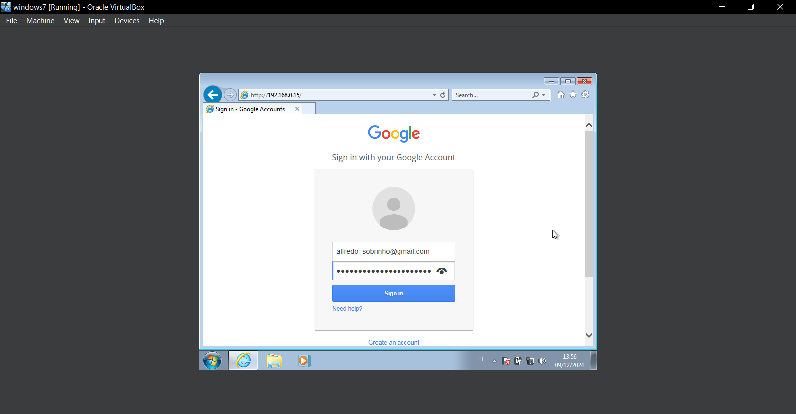
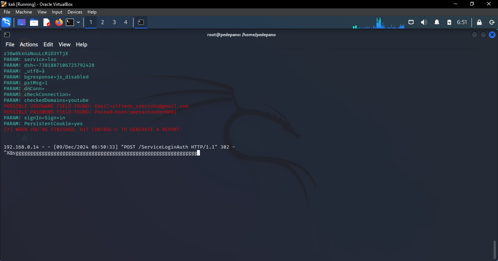

# Phishing para captura de senhas do Google

- tipo de phishing que utiliza clonagem de páginas como facebook, instagram, google entre outros, para furtos de credenciais.

### Ferramentas ultilizadas

- Kali Linux
- setoolkit
- Máquina virtual (VirtualBox)


### Configurações iniciais:

 - Na VM -> Configurações -> Rede -> Selecionar a opção 'Placa em modo Bridge'.


### Configurando o Phishing no Kali Linux

- Acesso root: ``` sudo su ```
- Iniciando o setoolkit: ``` setoolkit ```
- Tipo de ataque: ``` Social-Engineering Attacks ```
- Vetor de ataque: ``` Web Site Attack Vectors ```
- Método de ataque: ```Credential Harvester Attack Method ```
- Método de ataque: ``` Web Templates ```
- Obtendo o endereço da máquina: ``` ifconfig ```
- Selecionar o template: ``` Google ```

### Resutados

- Adicionando credenciais em uma página clone.




- Após clicar em 'Sign in', as informações adicionadas nos campos irão para meu terminal no kali linux:




Conclusão:

Não clique em links indiscriminadamente, valide sempre o domínio e, ao inserir informações, certifique-se de estar em sites oficiais. A segurança online é uma responsabilidade pessoal. Mantenha-se atento, proteja suas credenciais e contribua para um ambiente digital mais seguro.